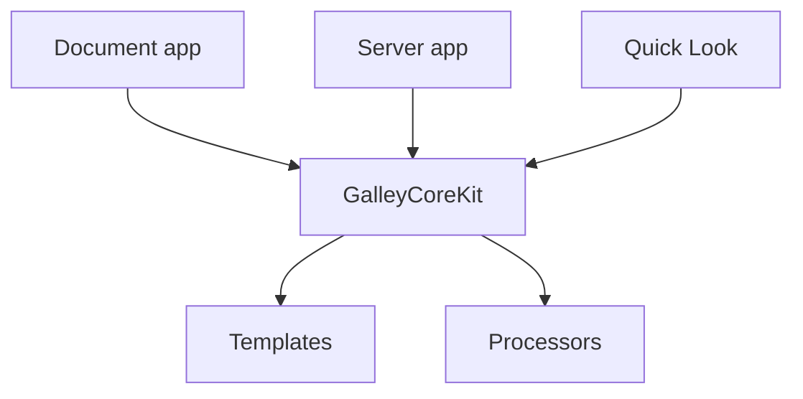

# Competitive Analysis — macOS Markdown Preview Apps

> Status: snapshot taken 2026-05-07. Pricing and version details drift; treat the
> feature matrix as a guide, not a contract.

This document surveys the standalone Markdown preview apps for macOS that are
adjacent to Galley, compares them feature by feature, and identifies where
Galley is genuinely differentiated and where it is weaker than the leaders.
Editors with built-in preview (VS Code, Obsidian, Typora, iA Writer) are
intentionally out of scope — Galley does not compete with editors. The focus is
on apps whose primary job is to render `.md` files for reading, paired with an
external editor (or no editor at all).

---

## 1. Market segmentation

The market for "show me this `.md` file" splits into four distinct shapes:

### Segment A — Preview companions (the "Marked 2 model")

A standalone window that watches a file on disk and re-renders on every save.
The user keeps editing in their editor of choice; the previewer is a separate
app whose only job is to render. This is Galley's primary segment.

- **Marked 2** — the reference product, established 2011, very mature.
- **Markoff** — free, CommonMark-only, lightweight.
- **PreviewMarkdown** (smittytone) — small, free, host app + QL extension.
- **Markdown Preview** (md-preview.app) — open-source, MIT, very minimal.
- **Galley** — what we ship.

### Segment B — Document readers (the "Preview.app for Markdown" model)

Closer to a PDF reader: open a file, read it, close it. Less emphasis on
file-watching; more emphasis on reading comfort, search, table of contents,
diagrams.

- **MacMD Viewer** — newer, SwiftUI-native, $19.99, ~2 MB binary.

This is a genuine adjacent segment that Galley partially serves through its
`WindowGroup<URL>` navigator model.

### Segment C — Quick Look extensions only

No host app, just `.appex` bundles that integrate with Finder Space-bar
preview, Spotlight, and Mail attachments.

- **QLMarkdown** (sbarex) — by far the most feature-rich QL plug-in in the
  ecosystem. Open-source, free.
- **Apple's built-in Markdown QL** — shipped in macOS 26, covers ~80% of
  casual usage.

Galley's `Quicklook.appex` competes directly here, with a server-first design
that no competitor offers.

### Segment D — Split-pane editors (out of scope but adjacent)

Editor + preview in one window. Different product shape, different audience,
but worth mentioning because users sometimes evaluate them in the same
breath.

- **MacDown** — open-source, free, but stale since 2020. No Apple Silicon
  native build at the time of this survey.
- **iA Writer** — $49.99, polished, primarily an editor.
- **Typora** — $14.99, Electron-based WYSIWYG-ish.
- **Obsidian** — free for personal use, knowledge-base focus, Electron.
- **Clearly** — newer, native, knowledge-base focus.
- **BBEdit** — has `Markup → Preview in BBEdit`; this is the source of
  Galley's `#TOKEN#` placeholder convention and the BBEdit helper script
  Galley installs. Galley is positioned to *complement* BBEdit, not replace
  its preview pane.

---

## 2. Detailed competitor profiles

### 2.1 Marked 2

**Pricing.** $13.99 direct DMG; $14.99 Mac App Store. One-time purchase, no
subscription. Free crossgrade from MAS to direct DMG when the user needs
features the App Store sandbox forbids (most importantly, Pandoc).

**Position.** "Smarter tools for smarter writers." Marked 2 frames itself
explicitly as a *writer's* tool, not a developer's tool. Its biggest
differentiators are writing-analysis features, not technical features.

**Rendering.** MultiMarkdown built in; Discount available as an alternative
built-in renderer. Custom processor slot supports Pandoc, kramdown, marked
(discount), MultiMarkdown 6, maruku, and arbitrary scripts that read stdin and
write stdout. **The MAS build cannot run Pandoc** — the sandbox forbids
launching arbitrary executables; the direct DMG can.

**Themes.** Nine built-in CSS preview styles, including "Ink" (Edward
Tufte-inspired) and a GitHub style. Unlimited custom CSS themes. CSS hot-reloads
on save without refreshing the preview.

**File watching.** Reliable. Updates faster than the version-2.5 baseline; the
docs claim it scrolls to the most recent edit automatically.

**Multi-file documents (book mode).** Supports MultiMarkdown transclusion via
`<<[path/file]` syntax with blank lines above and below. Also recognizes
Leanpub, GitBook, and mmd_merge index file conventions. All transcluded files
are watched for changes (depends on Spotlight indexing). Marked 2's "book mode"
is its term for this — see the explainer at the end of this document.

**Writing analysis (the signature feature).**
- Spelling and grammar checking.
- Word count, sentence count, sentence complexity scoring.
- Reading time estimation.
- Grade-level scoring (Flesch–Kincaid family).
- "Tips for simplifying your sentences" — a built-in style critic.
- Markdown syntax validation; flags syntax that won't normalize across
  flavors.

**Navigation.** Auto-generated table of contents; typeahead search; bookmarks;
full keyboard navigation; collapsible sections.

**Export.** HTML (with self-contained inlined images), Rich Text, PDF, OPML,
normalized Markdown. Can collate a multi-file index into a single rendered
"book."

**Integrations.** Scrivener 3, MarsEdit 4, Ulysses, nvALT, Bear, iThoughtsX,
MindNode, Highland, Fountain.io, TextBundles/TextPack, Leanpub. iA Writer's
`/filename` file include syntax.

**What Marked 2 does *not* have:**
- No HTTP server. Strictly a desktop window.
- No Quick Look extension.
- No source-line click-to-editor jumping. Cmd-click on a paragraph does not
  open BBEdit/VS Code/etc. at the right line.
- No per-document processor override beyond a single global custom-processor
  slot.
- No browser-based rendering path.

**Maturity.** Very high. ~15 years on the market. Active developer (Brett
Terpstra). The right competitor to learn from but not the right one to copy.

### 2.2 Markoff

**Pricing.** Free, Mac App Store. MIT licensed. Source on GitHub
(kaishin/markoff).

**Position.** "Lightweight CommonMark previewer." Knowingly minimal.

**Rendering.** cmark (C reference implementation of CommonMark). One renderer,
no plugins, no flavors. Faster than the Ruby/JavaScript renderers it set out
to replace, but locked to CommonMark — no MultiMarkdown features, no Pandoc
extensions, no `data-source-line` annotations.

**File watching.** Auto-reload on save. The blog and reviews emphasize that
this is faster and more reliable than even Sublime Text's preview.

**Themes.** Built-in CSS, basic. Syntax highlighting via highlight.js. Detects
YAML frontmatter and renders it as a code block.

**Editor integration.** Cmd-E (or toolbar/menu) opens the previewed file in
the user's chosen editor. Whole-file open only — no line targeting, no source
position information at all.

**Misc.** Word and character count.

**What Markoff does *not* have:**
- No custom processors. Locked to cmark.
- No HTTP server.
- No Quick Look extension.
- No source-line jumping.
- No custom HTML templates with placeholders.
- No multi-file or book mode.
- No PDF/RTF export.
- No writing analysis.

**Maturity.** Stable but quiet. Last meaningful updates years ago. Still works.

### 2.3 MacMD Viewer

**Pricing.** $19.99 one-time. 14-day money-back guarantee.

**Position.** "Native macOS reader for the .md files Claude, ChatGPT, and
Copilot keep generating." Explicitly pitched as "Preview.app for Markdown."
The 2026 audience: developers reading AI-generated Markdown reports.

**Rendering.** GitHub Flavored Markdown out of the box. Single renderer, not
configurable. ~2 MB binary, SwiftUI throughout.

**Mermaid.** First-class. Renders flowcharts, sequence diagrams, Gantt
charts, etc., inline. Pinch-to-zoom with vector sharpness.

**Syntax highlighting.** 190+ languages. Follows system theme.

**Themes.** Light and dark mode that follow the macOS appearance preference.
No user-customizable CSS.

**File watching.** Auto-update in ~50 ms (their claim) when the file is
saved.

**Quick Look extension.** Yes, ships with one. Works in Spotlight too.

**Export.** None native — relies on macOS Print → Save as PDF.

**Performance pitch.** Fast launch (~0.5 s claimed), small binary, native
SwiftUI. This is the "fast and modern" alternative to Marked 2.

**What MacMD Viewer does *not* have:**
- No custom processors.
- No HTTP server.
- No source-line jumping.
- No custom HTML templates.
- No multi-file or book mode.
- No writing analysis.
- No per-document settings.

**Maturity.** New. Aggressive marketing, modern stack, narrow scope.
Genuinely good at what it tries to do; doesn't try to be Marked 2.

### 2.4 PreviewMarkdown (smittytone)

**Pricing.** Free, Mac App Store.

**Position.** Quick Look first, host app second. The host app is mostly a
shell around a configurable QL extension.

**Features.** Theme/font customization, line-spacing controls, code-block
styling, YAML front-matter handling. Open-source.

**What PreviewMarkdown does *not* have:** essentially everything beyond
"render and read." No file watching, no processors, no HTTP server, no
source-line jumping, no templates, no writing analysis.

### 2.5 Markdown Preview (md-preview.app)

**Pricing.** Free, MIT, open-source.

**Position.** "Drop a `.md` on the icon, get a clean scrollable preview with
a real document outline. No Electron." The minimalist take.

**Features.** Native, single-purpose, document outline, can be set as the
default `.md` handler. Open source. Very small surface area.

**What it does *not* have:** processors, HTTP server, source-line jumping,
templates, writing analysis, book mode, custom CSS UI.

### 2.6 QLMarkdown (sbarex)

**Pricing.** Free, open-source, Homebrew cask available.

**Position.** Quick Look only. No host window for reading; just the QL
extension and a settings host app.

**Supported file types.** `.md`, `.rmd` (without R evaluation), `.mdx`
(without JSX), `.mdc` (Cursor rules), `.qmd` (Quarto), `.apib` (API
Blueprint), `.textbundle` packages.

**Extensions.** Emoji shortcodes (`:smile:`); heading anchors; `==highlight==`
syntax; inline embedding of local images so QL previews work on isolated
files; YAML header rendering; configurable behavior for external links
(open in QL window vs. default browser).

**Theming.** Multiple CSS themes; predefined GitHub-style theme that adapts to
light/dark; configurable code-block syntax highlighting theme.

**What QLMarkdown does *not* have:** any host-window functionality. It is
strictly a Quick Look extension. No file watching (QL is a one-shot render),
no source-line jumping, no HTTP server, no custom processors.

**Maturity.** Active, popular among developers, the de facto answer to "how
do I get good Markdown QL on my Mac" before Apple shipped its own in 26.

### 2.7 BBEdit (preview pane)

**Pricing.** $59.99 BBEdit; the preview pane works in the free mode too.

**Position.** Editor with a preview pane, not a previewer. Out of scope as a
*competitor*, but in scope as an *integration target* — Galley adopts
BBEdit's preview-template conventions specifically so users can keep using
the same templates they already wrote for BBEdit.

**Why it matters.** BBEdit's `Markup → Preview in BBEdit` and its
`Preview Markdown… → in Galley` script are the original sources of:

- The `#TOKEN#` placeholder vocabulary (`#TITLE#`, `#DOCUMENT_CONTENT#`,
  `#BASE#`, `#FILE#`, `#BASENAME#`, `#FILE_EXTENSION#`, `#DATE#`, `#TIME#`).
- The single-file template-with-sibling-assets convention.
- The relative-path rewriting convention that Galley's
  `UserTemplate.Rewriter` honors.

Galley's BBEdit-template compatibility is a deliberate choice: a
power-user audience already exists; let them keep their templates.

---

## 3. Feature matrix

Legend: ✅ supported, ⚠️ partial / limited, ❌ not supported, n/a not applicable
to that product shape.

### 3.1 Core preview behavior

| Capability | Marked 2 | Markoff | MacMD Viewer | QLMarkdown | PreviewMarkdown | md-preview | **Galley** |
|---|---|---|---|---|---|---|---|
| Standalone preview, no editor mode | ✅ | ✅ | ✅ | n/a | ⚠️ (QL+host) | ✅ | ✅ |
| Live reload on file save | ✅ | ✅ | ✅ | n/a | ❌ | ⚠️ | ✅ |
| Reload on CSS/template save | ✅ | ❌ | ❌ | n/a | ❌ | ❌ | ✅ (via `x-galley://` scheme + SSE) |
| Window per file (navigator) | ❌ | ❌ | ⚠️ | n/a | ❌ | ❌ | ✅ (`WindowGroup<URL>`) |
| Back/forward across linked `.md` | ❌ | ❌ | ⚠️ | n/a | ❌ | ❌ | ✅ |
| Tabs (newWindow / newTab / replaceCurrent) | ⚠️ window-only | window-only | ✅ | n/a | window-only | window-only | ✅ |
| Scroll position preserved across reload | ⚠️ | ⚠️ | ⚠️ | n/a | ❌ | ⚠️ | ✅ (`PerFileStateStore`) |

### 3.2 Rendering pipeline

| Capability | Marked 2 | Markoff | MacMD Viewer | QLMarkdown | **Galley** |
|---|---|---|---|---|---|
| Multiple Markdown processors | ✅ MMD + Discount + custom | ❌ cmark only | ❌ GFM only | ❌ cmark-gfm only | ✅ swift-markdown, MultiMarkdown, Pandoc, Discount, cmark-gfm, Markdown.pl |
| Pandoc support | ⚠️ DMG only, custom slot | ❌ | ❌ | ❌ | ✅ (built into the catalog) |
| MultiMarkdown native | ✅ | ❌ | ❌ | ❌ | ✅ |
| GitHub Flavored Markdown | ⚠️ via custom | ❌ | ✅ | ✅ | ✅ via cmark-gfm |
| Per-document processor override | ⚠️ single per-doc slot | ❌ | ❌ | ❌ | ✅ (`SceneProcessorModel` + `PerFileStateStore`) |
| Mermaid diagrams | ⚠️ via custom processor | ❌ | ✅ | ⚠️ | ⚠️ depends on processor |
| Math (KaTeX/MathJax) | ✅ | ❌ | ❌ | ❌ | ⚠️ depends on processor + template |
| Syntax-highlighted code blocks | ✅ | ✅ via highlight.js | ✅ 190+ langs | ✅ | ⚠️ depends on processor + template |

### 3.3 Templating and theming

| Capability | Marked 2 | Markoff | MacMD Viewer | QLMarkdown | **Galley** |
|---|---|---|---|---|---|
| Built-in CSS themes | ✅ 9 styles | ⚠️ basic | ⚠️ light/dark | ✅ several | ⚠️ one default |
| User-installable themes/templates | ✅ unlimited custom CSS | ❌ | ❌ | ⚠️ themes only | ✅ HTML templates with assets |
| Full HTML template (not just CSS) | ❌ | ❌ | ❌ | ❌ | ✅ (`UserTemplate`) |
| `#TOKEN#` placeholder substitution | ❌ | ❌ | ❌ | ❌ | ✅ |
| BBEdit preview-template compatibility | ❌ | ❌ | ❌ | ❌ | ✅ (folder *and* single-file shapes) |
| Asset path rewriting (`/template/`, `/preview/`) | ❌ | ❌ | ❌ | ❌ | ✅ |
| Per-document template override | ❌ | ❌ | ❌ | ❌ | ✅ (`SceneTemplateModel`) |

### 3.4 Editor integration

| Capability | Marked 2 | Markoff | MacMD Viewer | QLMarkdown | **Galley** |
|---|---|---|---|---|---|
| Open in external editor | ⚠️ file-only | ✅ Cmd-E, file-only | ❌ | n/a | ✅ |
| Cmd-click block → editor at exact line | ❌ | ❌ | ❌ | ❌ | ✅ |
| Multiple editor presets | ❌ | ⚠️ single configurable | ❌ | n/a | ✅ BBEdit, TextMate, VS Code, Sublime, Zed |
| Custom URL template per editor | ❌ | ❌ | ❌ | n/a | ✅ (`{url}`/`{path}`/`{line}`) |
| Source-position annotations honored | ❌ | ❌ | ❌ | ❌ | ✅ (`data-source-line`, pandoc `data-pos`, cmark-gfm `data-sourcepos`) |

### 3.5 Distribution surfaces

| Capability | Marked 2 | Markoff | MacMD Viewer | QLMarkdown | **Galley** |
|---|---|---|---|---|---|
| Desktop window | ✅ | ✅ | ✅ | ❌ | ✅ |
| Quick Look extension | ❌ | ❌ | ✅ | ✅ (only product) | ✅ |
| HTTP server for browsers | ❌ | ❌ | ❌ | ❌ | ✅ FlyingFox + SSE |
| Menu-bar app for headless server | ❌ | ❌ | ❌ | ❌ | ✅ (Galley Server) |
| BBEdit preview-pane integration | ❌ | ❌ | ❌ | ❌ | ✅ (helper script + same template format) |
| URL scheme for external invocation | ❌ | ❌ | ❌ | n/a | ✅ (`galley://path?line=N`) |

### 3.6 Output and export

| Capability | Marked 2 | Markoff | MacMD Viewer | QLMarkdown | **Galley** |
|---|---|---|---|---|---|
| Print | ✅ | ⚠️ | ⚠️ via system | ❌ | ✅ |
| Page Setup | ✅ | ⚠️ | ⚠️ | ❌ | ✅ |
| Export PDF | ✅ | ⚠️ via Print | ⚠️ via Print | ❌ | ✅ (offscreen WKWebView pipeline) |
| Export HTML (self-contained) | ✅ inlined images | ❌ | ❌ | ❌ | ❌ |
| Export Rich Text | ✅ | ❌ | ❌ | ❌ | ❌ |
| Export OPML | ✅ | ❌ | ❌ | ❌ | ❌ |
| Output normalized Markdown | ✅ | ❌ | ❌ | ❌ | ❌ |

### 3.7 Multi-file / book mode

| Capability | Marked 2 | Markoff | MacMD Viewer | QLMarkdown | **Galley** |
|---|---|---|---|---|---|
| Transclusion (`<<[file]`) | ✅ | ❌ | ❌ | ❌ | ⚠️ via processor (MMD does it) |
| Leanpub / GitBook / mmd_merge index | ✅ | ❌ | ❌ | ❌ | ❌ |
| Watch transcluded files | ✅ via Spotlight | ❌ | ❌ | ❌ | ⚠️ same-folder watch only |
| Collate to single rendered output | ✅ | ❌ | ❌ | ❌ | ❌ |

### 3.8 Writing analysis

| Capability | Marked 2 | Markoff | MacMD Viewer | QLMarkdown | **Galley** |
|---|---|---|---|---|---|
| Word / sentence count | ✅ | ⚠️ word/char only | ❌ | ❌ | ❌ |
| Reading time | ✅ | ❌ | ❌ | ❌ | ❌ |
| Grade-level scoring | ✅ | ❌ | ❌ | ❌ | ❌ |
| Sentence complexity | ✅ | ❌ | ❌ | ❌ | ❌ |
| Spelling / grammar | ✅ | ❌ | ❌ | ❌ | ❌ |
| Markdown syntax validation | ✅ | ❌ | ❌ | ❌ | ❌ |

### 3.9 Navigation aids

| Capability | Marked 2 | Markoff | MacMD Viewer | QLMarkdown | **Galley** |
|---|---|---|---|---|---|
| Auto table of contents | ✅ | ❌ | ✅ | ❌ | ⚠️ depends on template |
| Typeahead / search | ✅ | ❌ | ✅ | ❌ | ❌ |
| Bookmarks | ✅ | ❌ | ❌ | ❌ | ❌ |
| Document outline view | ✅ | ❌ | ✅ | ❌ | ❌ |

### 3.10 Distribution and trust

| Property | Marked 2 | Markoff | MacMD Viewer | QLMarkdown | **Galley** |
|---|---|---|---|---|---|
| Mac App Store | ✅ (limited) + DMG | ✅ | ✅ | ❌ (Homebrew/GH) | ❌ (GH releases) |
| Open source | ❌ | ✅ MIT | ❌ | ✅ | ✅ |
| Sandboxed | ✅ MAS / ❌ DMG | ✅ | ✅ | ❌ | ❌ (deliberate) |
| Notarized / signed | ✅ | ✅ | ✅ | ✅ | ⚠️ ad-hoc; CI workflow disabled |
| Localized | many locales | EN | EN | several | EN + RU |

---

## 4. Where Galley is genuinely differentiated

These are durable advantages — items where Galley is the *only* product in the
ecosystem with the capability, or where the next-best option is significantly
weaker.

### 4.1 Browser-or-app duality (the killer feature)

**No competitor ships an HTTP server alongside the document app.** Marked 2
locks rendering to its own AppKit window. QLMarkdown locks rendering to Quick
Look. MacMD Viewer locks rendering to its native window.

Galley Server is a separate menu-bar app that exposes the same rendering
engine over HTTP at `http://localhost:<port>/preview/<absolute-path>`. That
single design decision unlocks four use cases that no other product can serve:

1. **BBEdit's preview pane** can hit the local server and render through the
   user's chosen processor — the BBEdit pane becomes a Galley pane.
2. **Any browser tab** can serve as the preview window. Useful for users on
   tiling window managers, on multiple monitors, or recording screencasts.
3. **External tooling** (CI scripts, watchers, IDE plug-ins) can curl the
   server during local development without launching a GUI.
4. **The Quick Look extension** asks the running server first, so QL previews
   honor the user's processor and template choices instead of always using
   the bundled defaults.

Implementation reality: this works because rendering and templating live in
`GalleyCoreKit` (no UI dependencies), the server is `GalleyServerKit`
(FlyingFox), and both apps link them. The cost of *adding* the server to the
product was low; the value of having it is high.

### 4.2 BBEdit template compatibility + `#TOKEN#` placeholders

The single most under-marketed feature in the product. The BBEdit power-user
audience has existed for 30 years and has accumulated a personal library of
preview templates. Marked 2 ignores them and forces users to write CSS in
Marked's idiom. Galley accepts BBEdit templates *unchanged*:

- Both shapes are recognized — folder containing `Template.html`, or a
  top-level `*.html`/`*.htm` file with sibling assets.
- All the BBEdit-named placeholders are supported (`#TITLE#`,
  `#DOCUMENT_CONTENT#`, `#BASE#`, `#FILE#`, `#BASENAME#`, `#FILE_EXTENSION#`,
  `#DATE#`, `#TIME#`).
- Asset paths are rewritten through `/template/<id>/...` and
  `/preview/<absolute-path>` (also a BBEdit convention).

Marketing implication: there is a small, durable, well-defined audience here.
Galley should be on every BBEdit power-user blog post and every BBEdit-related
forum thread.

### 4.3 Cmd-click block → editor at exact source line

No other previewer does this. Marked 2's "open in editor" opens the file.
Markoff's Cmd-E opens the file. MacMD Viewer doesn't have it. QLMarkdown
doesn't have it (QL has no concept of an editor).

Galley reads three different source-position annotation formats and lands on
the right line in the user's editor of choice:

- `data-source-line="N"` — emitted by `SwiftMarkdownRenderer` when
  `annotatesSourceLines` is on.
- `data-pos="line@col-line@col"` — emitted by Pandoc with
  `--sourcepos` (Galley parses but only uses the start line).
- `data-sourcepos="line:col-line:col"` — emitted by cmark-gfm with the
  `sourcepos` extension.

Five editor presets ship out of the box (BBEdit, TextMate, VS Code, Sublime,
Zed) plus a custom-URL template with `{url}`/`{path}`/`{line}` placeholders for
anything else. A bundle URL fallback catches editors that don't have a URL
scheme (silently drops the line, the only honest option).

This is the feature that turns Galley from "a previewer" into "a navigator
that closes the loop back to the editor." Worth pitching that way.

### 4.4 Five-processor catalog with per-document override

Marked 2 has *one* user-configured custom-processor slot. Galley enumerates
installed processors (swift-markdown built-in, MultiMarkdown, Pandoc,
Discount, cmark-gfm, Markdown.pl) and lets each document pick. The picker is
in the menu bar and the toolbar, and selections persist in `PerFileStateStore`
keyed by file path.

For a Pandoc-heavy academic user with `.md` files that need different
extensions enabled, this is meaningful — the alternative in Marked 2 is
swapping the global custom-processor configuration every time you switch
projects.

### 4.5 Navigator model — `WindowGroup<URL>` with history

Marked 2, Markoff, and most QL extensions are file-pinned: one window
represents one file forever. Galley behaves like a browser for a Markdown
directory — clicking `[link](other.md)` rebinds the window with back/forward
history, while `[link](http://...)` opens in the system browser, and other
local files go to `NSWorkspace`.

This matches how people actually read project documentation: jumping from
`README.md` to `docs/setup.md` to `docs/architecture.md` and back again. It's
the right shape for *reading*, not just for *previewing while editing*.

### 4.6 Multiple distribution surfaces, one engine

Galley is the only product that ships:

- A document app.
- A menu-bar HTTP server.
- A Quick Look extension that prefers the server but falls back gracefully.
- A URL scheme for external invocation.
- A BBEdit helper script for one-click integration.

Each surface uses the same `GalleyCoreKit` engine, so processor + template
selections are honored consistently across all of them.

---

## 5. Where Galley is weaker than the leaders

Honest gaps. None of these are existential, but each is a real reason a
specific user might pick a competitor.

### 5.1 No writing-analysis features

Marked 2's signature: word/sentence count, reading time, grade-level scoring,
sentence-complexity tips, spelling/grammar, Markdown syntax validation.

This is a different audience — *writers*, not *readers*. If Galley wants to
compete here, it's a multi-month effort. If Galley positions itself as a
reader/developer tool, it can ignore this gap entirely. Recommendation: skip
unless the audience strategy changes.

### 5.2 No CSS theme picker UI

Templates are powerful but heavier than "pick from a dropdown of nine
styles." A first-time user opening Galley sees one default rendering and a
template menu that's empty until they install something.

A small built-in theme list layered on top of the template engine would
close most of this gap with a few weeks of work. See the future-development
document.

### 5.3 No collation / book mode / transclusion

Marked 2 can stitch a multi-chapter book together via Leanpub/GitBook/mmd_merge
indexes or `<<[file]` transclusion, watch all the included files, and export
the whole thing as a single PDF or HTML.

Galley's same-folder document watcher only watches sibling assets, not
transcluded chapters. For users writing books or long technical reports,
this is a real limitation.

### 5.4 No first-class Mermaid

MacMD Viewer's headline feature; QLMarkdown supports it; Marked 2 reaches it
via custom processor. Galley reaches it only if the user picks a processor
+ template combination that includes the Mermaid runtime. The default template
doesn't.

### 5.5 No auto-generated TOC, search, or document outline

Marked 2 and MacMD Viewer both ship a TOC sidebar with typeahead search that
follows the active heading as you scroll. Galley relies on the template to
provide one, which means in practice most users don't get one.

### 5.6 No App Store presence

Marked 2, Markoff, MacMD Viewer, PreviewMarkdown all ship through MAS.
Galley ships GitHub releases only. The `release.yml` workflow for signed
+ notarized CI is in the repo but disabled.

This matters for discoverability — App Store search is the first place most
users look — and for trust (notarization, sandbox guarantees). The notarized
DMG path is a strict requirement to even *consider* MAS distribution.

### 5.7 Limited localization

EN + RU only. Marked 2 ships in many languages; the target audience for a
Markdown previewer is global.

### 5.8 No writing-friendly export beyond PDF

Marked 2 exports HTML with self-contained inlined images, RTF, OPML,
normalized Markdown. Galley exports PDF only. For users handing rendered
output to colleagues or to a CMS, the gap is real.

### 5.9 Marketing surface area

Marked 2 has 15 years of accumulated reviews, blog posts, and Brett
Terpstra's personal brand. MacMD Viewer is aggressively SEO'd against
"AI-generated `.md` files." Galley has a README and a GitHub repo. The
product is genuinely better in several technical dimensions; nobody knows.

---

## 6. Positioning recommendation

Galley's natural pitch is **"the BBEdit-friendly Markdown previewer with a
built-in HTTP server and click-to-source jumping."** That is a tight wedge
against Marked 2:

- **Same** live-reload story.
- **Broader** processor and template compatibility.
- **Only** product that lets cmd-click on a paragraph open the right line in
  your editor.
- **Only** product that lets BBEdit's preview pane render through your chosen
  processor.

The audience that cares about that pitch is small but well-defined:

- BBEdit power users with template libraries.
- Pandoc users who want a previewer that respects Pandoc's source-position
  annotations.
- Developers who read repo docs in the browser and want it to live-reload.
- Quick Look users who want previews that match their app rendering.

Don't try to out-feature Marked 2 on writing analysis — it's their game and
not the same audience. Don't try to out-polish MacMD Viewer on Mermaid +
GFM — they're built around it. Compete where the architecture is uniquely
suited: the engine-shared-across-surfaces story.

---

## 7. Glossary

### Mermaid

[Mermaid](https://mermaid.js.org/) is a JavaScript-based diagramming and
charting library that renders Markdown-inspired text definitions into SVG
diagrams in the browser. The advantage over external diagramming tools is
that the diagram source lives inside the Markdown file itself, version-controls
cleanly, and stays in sync with the surrounding documentation.

A Mermaid diagram is a fenced code block tagged `mermaid`:

````markdown

````

A previewer that "supports Mermaid" embeds the Mermaid runtime in its render
template and turns those code blocks into rendered SVG diagrams instead of
showing them as raw text. Mermaid handles flowcharts, sequence diagrams,
class diagrams, state diagrams, ER diagrams, Gantt charts, pie charts, user
journey diagrams, and a few more. It is widely supported on GitHub, GitLab,
Obsidian, Notion, MkDocs, and most static-site generators, which is why it
has become the de facto standard for "diagrams in Markdown."

For Galley, "first-class Mermaid" would mean: the bundled default template
includes the Mermaid runtime and runs it on `pre code.language-mermaid`
blocks regardless of which processor produced them. Today that depends on
the user choosing a processor + template combination that does it.

### Book mode

"Book mode" is Marked 2's term for *multi-file document rendering* — treating
a single `index` file as the manifest for a longer work composed of many
chapter files, watching all of them for changes, and rendering them as a
single concatenated document.

The mechanic comes in two shapes:

**1. Index-file conventions.** A plain-text file lists the included files in
order. Marked 2 recognizes the conventions used by:

- **Leanpub** (`Book.txt`) — one filename per line.
- **GitBook** (`SUMMARY.md`) — Markdown-formatted nested chapter list.
- **mmd_merge** (MultiMarkdown's tool) — a bare list of files.

When the user opens any of these as the *index* in Marked, Marked
concatenates all the listed files in order, watches each of them for
changes, and re-renders the concatenated result whenever any constituent
file is saved.

**2. Inline transclusion.** A Markdown file references another file at a
specific point with the syntax:

```markdown
<<[chapters/intro.md]
```

(blank lines required above and below). The transcluded file's rendered
output is inlined at that point. The resulting "compiled" document can then
be exported as a single PDF, HTML file, or normalized Markdown.

The use case is technical books, long manuals, and academic reports where
the source is split across many files for editing convenience but the output
needs to be a single artifact.

For Galley, "supporting book mode" would mean: detect index conventions,
extend the document watcher to follow transcluded files (today it only
watches the document and its sibling directory), and add a "compile to single
PDF/HTML" export path. It's a substantial feature — see the
future-development document for sequencing.

---

## 8. Sources

- [Marked 2](https://marked2app.com/)
- [Marked 2 Press Kit](https://marked2app.com/press/)
- [Marked 2 — Custom Processor docs](https://marked2app.com/help/Custom_Processor.html)
- [Marked 2 — Multi-file Documents](https://marked2app.com/help/Multi-File_Documents.html)
- [Markoff (kaishin/markoff)](https://github.com/kaishin/markoff)
- [Markoff on thoughtbot blog](https://thoughtbot.com/blog/markoff-free-markdown-previewer)
- [MacMD Viewer](https://macmdviewer.com/)
- [MacMD Viewer — viewers roundup](https://macmdviewer.com/blog/markdown-viewer-macos)
- [MacDown](https://macdown.uranusjr.com/)
- [Markdown Preview (md-preview.app)](https://md-preview.app/)
- [PreviewMarkdown on Mac App Store](https://apps.apple.com/us/app/previewmarkdown/id1492280469?mt=12)
- [QLMarkdown (sbarex)](https://github.com/sbarex/QLMarkdown)
- [Top 12 macOS Markdown Viewer Tools — DeepDocs](https://deepdocs.dev/macos-markdown-viewer/)
- [Mermaid — official site](https://mermaid.js.org/)
- [Mermaid on GitHub](https://github.com/mermaid-js/mermaid)
